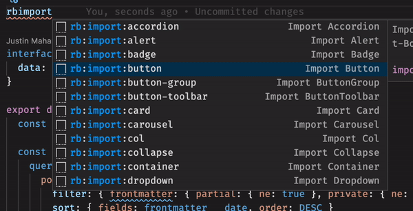
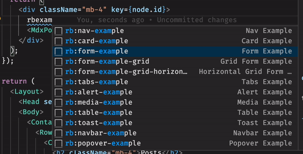
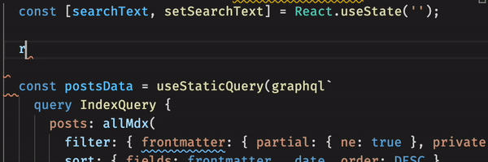
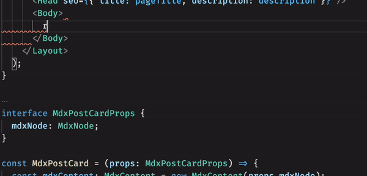

# React-Bootstrap Snippets

[](https://marketplace.visualstudio.com/items?itemName=justinmahar.react-bootstrap-snippets)

This extension includes 386 [React-Bootstrap](https://react-bootstrap.github.io/) snippets for VS Code.

Build apps with React-Bootstrap at your fingertips.

This extension supports:

- 🙌 All `react-bootstrap` components. The complete picture.
- 📦 `import` snippets, for quick and easy importing.
- 💁‍♀️ Example snippets from the docs for convenience.

**Just type `rb` and press <kbd>Ctrl</kbd>+<kbd>Space</kbd> for autocompletion. VS Code will autocomplete the component you need.**


Read below for more information and gif demos.

> Loving it? **[Rate it here!](https://marketplace.visualstudio.com/items?itemName=justinmahar.react-bootstrap-snippets&ssr=false#review-details)**

## 📚 Supported languages (file extensions)
- JavaScript (.js)
- JavaScript React (.jsx)
- TypeScript (.ts)
- TypeScript React (.tsx)

## 📖 Snippets

**All snippets start with `rb` for React-Bootstrap.**

There are 386 snippets available for components, imports, and examples. Read more on each below.

### Component Snippets

All React-Bootstrap's components are supported as of version `v2.0.0-rc.0`.

For example, `rb:alert`, `rb:badge`, `rb:breadcrumb`, etc.

Where applicable, suggestions are made for which components to use inside a given component, such as `thead` and `tbody` inside a `Table`.

### Import Snippets

Component import snippets are available for all React-Bootstrap components. 

All imports begin with `rb:import` followed by the component name. For example, `rb:import:row` will import `Row`. 

Since it's such a common use case, you can also use `rb:import:grid` to import `Container`, `Row`, and `Col` all at once.



### Example Snippets

Where applicable, examples from the docs are provided as snippets. These can be very helpful as a starting point when working with more complex components, or for use as quick placeholders.

Example snippets all end with `-example`. 

For instance, `rb:alert-example` will insert an example `Alert` to build upon.



### Alert and Modal Functions

For convenience, function snippets are included for the show/hide functions needed for modals and dismissible alerts.



Use `rb:modal-functions` for the following:

```tsx
const [showModal, setShowModal] = React.useState(false);
const handleCloseModal = () => setShowModal(false);
const handleShowModal = () => setShowModal(true);
```

And `rb:alert-dismissible-functions` for the following:

```tsx
const [showAlert, setShowAlert] = React.useState(false);
const handleCloseAlert = () => setShowAlert(false);
const handleShowAlert = () => setShowAlert(true);
```

These pair nicely with the snippets for `rb:modal` and `rb:alert-dismissible`.

### Table Utilities

This extension includes utilities for tables so you can quickly build table headers and table rows.

Use `rb:table-row-X` and `rb:table-header-row-X`, where `X` is the number of columns from 2-9, to quickly build rows in your `thead` and `tbody`.



## A Note To You, The Developer

My goal was to make this one of the best snippets extensions available to you. As such, I spent countless hours reading the docs to make this as great as I could, and I truly hope you find it useful.

That being said, if you find a bug or see a way to improve this extension, please feel free to [open an issue](https://github.com/justinmahar/vscode-react-bootstrap-snippets/issues) or submit a [pull request to the project](https://github.com/justinmahar/vscode-react-bootstrap-snippets).

If you found this extension helpful, consider **[rating it](https://marketplace.visualstudio.com/items?itemName=justinmahar.react-bootstrap-snippets&ssr=false#review-details)** and **[give it a star](https://github.com/justinmahar/vscode-react-bootstrap-snippets)** so others can find it.

Happy coding 🖖

## You Might Also Like...

- [React-Icons Snippets](https://marketplace.visualstudio.com/items?itemName=justinmahar.react-icons-snippets) - Code snippets for React-Icons

## Release Notes

### [1.0.0] - 2021-05-17

- Initial release of React-Bootstrap snippets.

### [1.0.1]-[1.0.7] - 2021-05-18

- Update documentation. 
- Add demo gifs.

### [1.0.8] - 2021-06-05

- Add tabstops to function snippets

### [1.0.9] - 2021-06-07

- Remove languages VS Code does not indicate support for (jsx, jsx-attr). Update docs.

