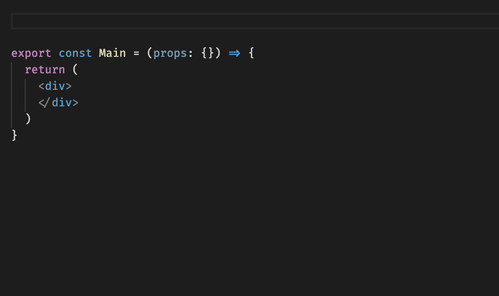

# React-Bootstrap Snippets

It's finally here! 350+ [React-Bootstrap](https://react-bootstrap.github.io/) snippets for VS Code.

This extension supports:

- 🙌 All React-Bootstrap components
- 💁‍♀️ Import snippets, for quick importing
- 🙋‍♂️ Example snippets from the docs for convenience

> Type `rb` and press <kbd>Ctrl</kbd>+<kbd>Space</kbd> for autocompletion. VS Code will autocomplete to the component you're looking for, making building using React-Bootstrap an absolute pleasure.

See below for more!

## 📚 Supported languages (file extensions)
- JavaScript (.js)
- JavaScript React (.jsx)
- TypeScript (.ts)
- TypeScript React (.tsx)

## 📖 Snippets

**All snippets start with `rb` (for React-Bootstrap).**

There are over 350 snippets available for components, imports, and examples. Read more on each below.

### Component Snippets

All of React-Bootstrap's components are supported.

For example, `rb:alert`, `rb:badge`, `rb:breadrcumb`, etc.

Where applicable, suggestions are made for which components to use inside a given component, such as `thead` and `tbody` inside a `Table`.

### Import Snippets

Component import snippets are available for all React-Bootstrap components. 

All imports begin with `rb:import` followed by the component name. For example, `rb:import:row` will import `Row`. 

You can also use `rb:import:grid` to import `Container`, `Row`, and `Col` all at once.

### Example Snippets

Where applicable, examples from the docs are provided as snippets. These can be very helpful as a starting point when working with more complex components, or for use as quick placeholders.

Example snippets all end with `-example`. 

For instance, `rb:alert-example` will insert an example `Alert` to build upon.

## Release Notes

### 1.0.0

Initial release of React-Bootstrap snippets.

### 1.0.1

Update documentation.  Add demo gif.

## Contributing

My goal was to make this one of the best snippets extensions available. As such, I pored over the docs to make this as great as I could.

That being said, if you see a way to improve this extension, please feel free to submit a [pull request to the project](https://github.com/justinmahar/vscode-react-bootstrap-snippets).

If you found this extension helpful, please rate it and [star it](https://github.com/justinmahar/vscode-react-bootstrap-snippets) so others can find it.

And as always, happy coding!